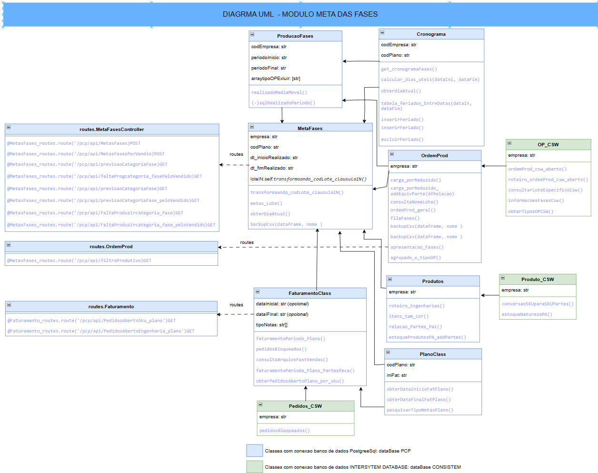

# PROJETO BACKEND - Gestão de Metas Industriais 
    Cliente: Grupo MPL
    Framework: Flask - python
    Criador: Luís Fernando Gonçalves de Lima Machado
    Versao Produção: 1.1 /Homologado 23-04-2025
    
## 1 Objetivo do Projeto
    
        Um microserviço backend que conecta-se ao ERP da Empresa 
    e ao banco de dados Postgre que está vinculado a aplicação, 
    produzindo Api's com informações sobre Metas de Produção Industrial.
### 1.1 definições:
      
      Aqui esta algumas definições utilizadas no projeto:
      
      Conceito de Fase:
         setor/célula industrial que compartilha processos semelhantes

      Conceito de Plano: 
          É o nome da coleção a ser planejada em uma linha de tempo,
      cadastrada em outro microserviço que complementa esse projeto
  
      Calculo das Metas  de produção:
        - Carga da Fase; ***qtd de pçs que se encontra na fase

        - Fila da Fase;  ***qtd de pçs a "chegar" na proxima fase

        - Cronograma de produção fase a fase ( dias úteis); 
        *** dias uteis disponivel para a fase produzir o que foi planejado;

        - Meta Total e Diaria  de cada fase; 
        ***qtd de peças que o setor deve produzir diariamente para atender ao plano
  

## 2 Inicializando o app
    
    1 - Configurar o projeto para o funcionamento: 
        
    1.1 variavéis de ambiente (ocultas) para Conexao: 
            criar arquivo _ambiente.env no diretorio PAI do projeto
    
    <Modelo ambiente_env:>

      POSTGRES_PASSWORD_SRV1=xxxx
      POSTGRES_PASSWORD_SRV2=xxxx
      POSTGRES_DB=xxxx
      POSTGRES_USER=xxxx
      POSTGRES_HOST_SRV1=xxx.xxx.x.xxx
      POSTGRES_HOST_SRV2=xxx.xxx.x.xxx
      POSTGRES_PORT = xxxx
      CSW_USER=xxxx
      CSW_PASSWORD=xxxx
      CSW_HOST=xxx.xxx.x.xxx
      CAMINHO_PARQUET_FAT=/xxxx/xxxx/xxxx/xxxx

    1.2 modificar a variavel global com o nome do local em ./src/configAPP,
    
    arquivo <configApp.py> :
        
        localProjeto = "xxxx/xxxx/xxxx"
    
    
        
    2 - Deploy da Aplicacao: 
        requeriments.txt
        app_run.py ("class main do projeto")
    
    2.1 - Alternativa via Docker: Dockerfile 
    

## 3 Detalhamento do Diagrama de Classes

