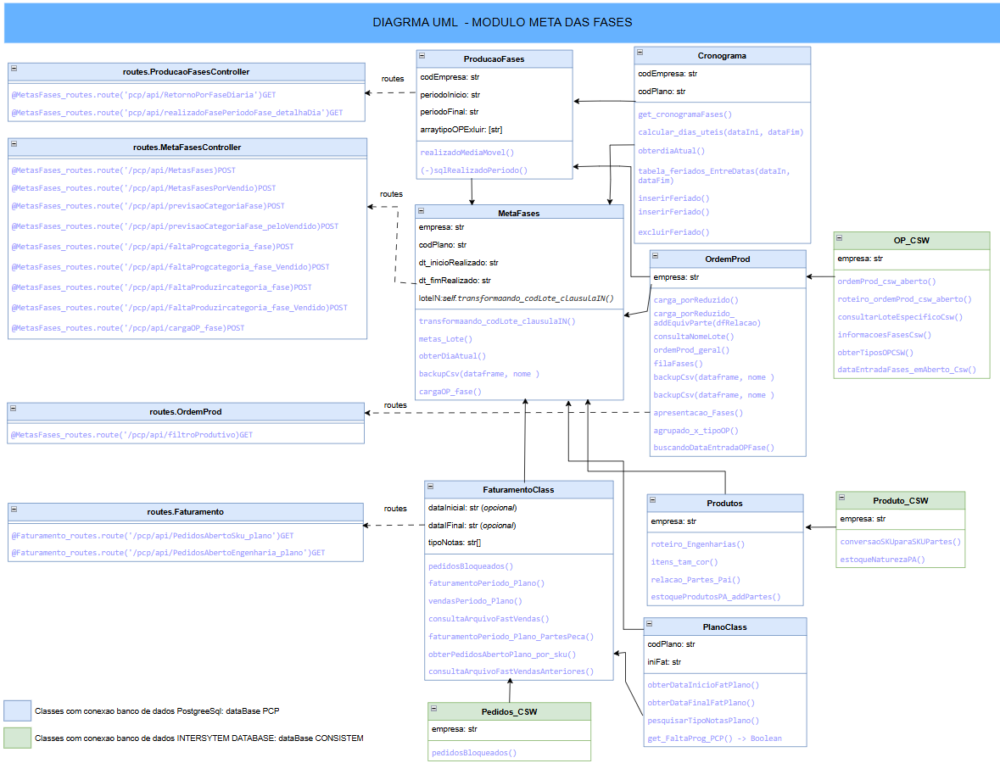

PROJETO BACKEND - GESTAO DE METAS INDUSTRIAL 

    Cliente: Grupo MPL
    Framework: Flask - python
    Criador: Luís Fernando Gonçalves de Lima Machado
    Versao Produção: 1.0 /Homologado 01-04-2025
    
OBJETIVO DO PROJETO
    
    Conectar os dados do ERP a essa aplicação, e desenvolver api's
    para desenvolvimento de dashborads e aplicações de planejamento e controle
    de Metas Industriais para a Empresa.

INICIALIZACAO
    
    1 - Configurar o projeto para o funcionamento: 
        1.1 variavéis de ambiente (ocultas) para Conexao: 
            criar arquivo _ambiente.env no diretorio PAI do projeto
        1.2 modificar a variavel global com o nome do local em ./src/configAPP,
            arquivo configApp.py 
        
    2 - Deploy da Aplicacao: 
        requeriments.txt
        app_run.py ("class main do projeto")
    
    2.1 - Alternativa via Docker: Dockerfile 
    

DETALHAMENTO DO DIAGRAMA

